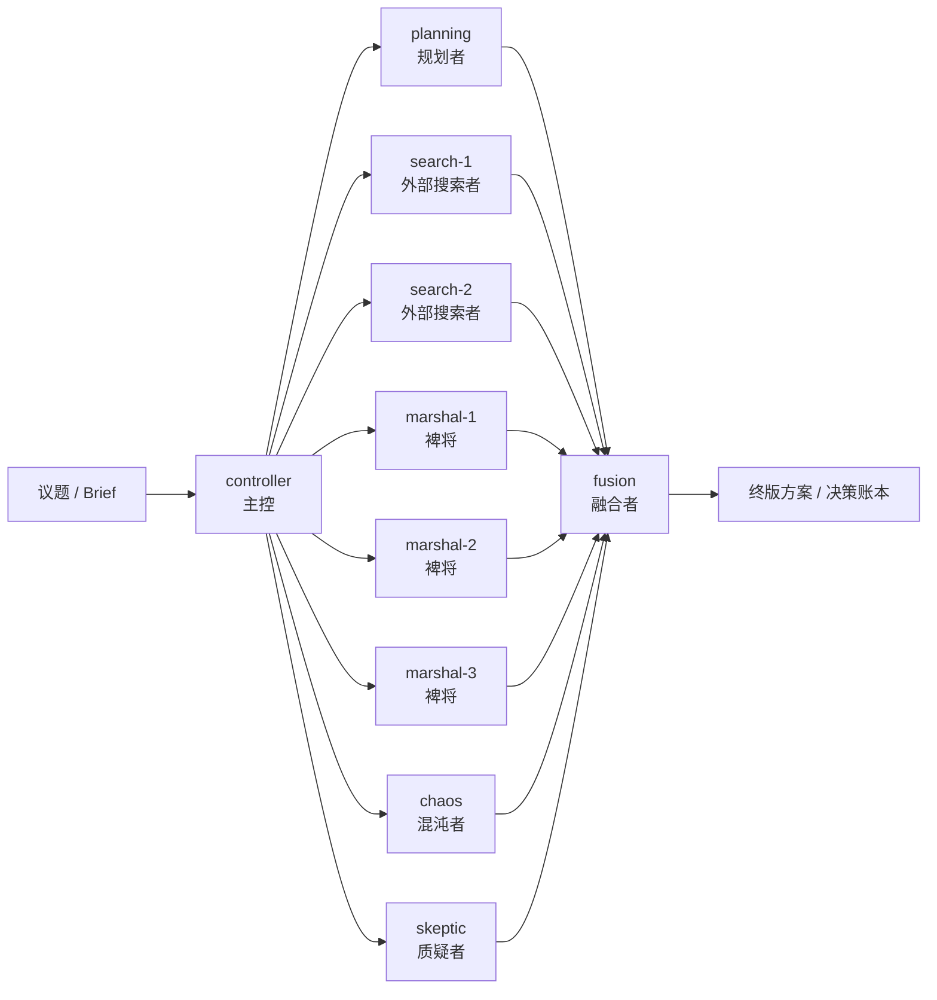
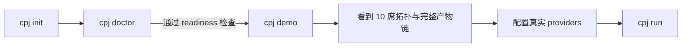

# 皮匠

> 三个臭裨将，顶个诸葛亮。

`皮匠` 是一个面向复杂议题的多模型议会能力层。

它不是让一个模型扮演多个角色，而是把多个真实模型位组织成一套可执行的议会工作流，让不同模型分别承担不同分析职责，然后完成：

`发散 -> 对抗 -> 整合 -> 收敛`

对外安装包名是 `pijiang`，主命令是 `cpj`。

## 一句话理解

如果你想要的不是“一个模型快速答一句”，而是一条更像真实团队讨论后产出的结构化方案链，`皮匠` 就是把这套能力做成了可嵌入现有入口的能力层。

- 不是单模型多角色扮演
- 是多模型、多职责的思路整合
- 默认采用 `10` 席完整议会
- 新用户先走 `cpj init -> cpj doctor -> cpj demo -> cpj run`

更细的图解说明见 [docs/demo-visuals.md](docs/demo-visuals.md)。

## 10 席议会拓扑

下面这张图不是人格关系图，而是职责拓扑图。



这张图要表达的核心是：

- `controller` 独立于 `planning`
- `search / marshal / chaos / skeptic / fusion` 都是分析职责
- 这里不是一个模型在演 10 个人，而是多个真实模型位在做思路整合

作为补充说明，标准 10 席分别是：

| 席位 | 职责 |
| --- | --- |
| `controller` | 主控，负责总体调度与最终收敛 |
| `planning` | 规划者，优先由 coding plan provider 承担 |
| `search-1` | 外部搜索者，偏产品/网页/资料检索 |
| `search-2` | 外部搜索者，偏 GitHub/案例/实现检索 |
| `marshal-1` | 裨将，偏工程可执行性与落地路径 |
| `marshal-2` | 裨将，偏结构整理、约束归纳与方案压缩 |
| `marshal-3` | 裨将，偏用户体验、可部署性与新手路径 |
| `chaos` | 混沌者，负责打破局部最优 |
| `skeptic` | 质疑者，负责红队拆解与失败模式 |
| `fusion` | 融合者，负责最终合并、决策账本与终版输出 |

## 新用户最短路径

不要一上来就直接 `cpj run`。



这条路径的目的很明确：

- `init`：先拿到标准配置和 Obsidian 模板
- `doctor`：先体检，而不是带着半残配置硬跑
- `demo`：先验证系统价值，不依赖真实 API
- `run`：只有在 provider 准备好后才进入真实运行

## demo 产物链

`cpj demo` 不是玩具模式，它的作用是让用户先看到皮匠真正的产物结构。


这也是皮匠和“只吐一段答案”的普通问答差别最大的地方：

- 有变体层
- 有对抗层
- 有融合层
- 有可回看的结构化产物链

## 它解决什么问题

普通单模型问答很适合快速响应，但一旦议题变复杂，往往会出现几个问题：

- 视角单一，容易掉进局部最优
- 没有外部搜索、强规划、红队质疑的显式分工
- 输出像答案，不像真正可执行的方案链
- 长流程等待时是黑盒，用户看不到系统到底在做什么

`皮匠` 的思路是把“多模型协作”做成一个可以嵌入现有入口的能力层，而不是强迫你换掉原来的工具。

## 安装

当前仓库已经公开，但 README 仍按“最稳安装路径”来写。

### 1. 从源码目录安装

```powershell
pipx install .
```

或：

```powershell
uv tool install .
```

### 2. 从 wheel 安装

先构建：

```powershell
python -m build
```

再安装：

```powershell
python -m pip install dist\pijiang-0.1.0-py3-none-any.whl
```

### 3. 从 PyPI 安装

下面这个命令是未来的目标形态；是否已实际发布到 PyPI，请以仓库 release 或 PyPI 页面为准：

```powershell
pipx install pijiang
```

## 3 分钟上手

### 1. 初始化标准配置与 Obsidian 模板

```powershell
cpj init --yes
```

它会生成：

- 一份标准配置
- 一份 `demo-config.json`
- 官方 `10` 席议会拓扑
- 官方 Obsidian Vault 模板

### 2. 先体检，而不是硬跑

```powershell
cpj doctor
```

如果你要把结果交给自动化系统判断：

```powershell
cpj doctor --json
```

`doctor` 会明确告诉你：

- 标准拓扑席位数
- 当前已启用席位数
- 当前可真实运行席位数
- readiness 是 `ready / warning / blocker`
- 哪些 provider 仍然只是占位模板
- 每个 HTTP provider 当前命中了 `relay_url`、结构化 endpoint，还是 legacy `base_url`

### 3. 先跑 demo，看系统价值

```powershell
cpj demo
```

`cpj demo` 不会调用真实外部 API，但会完整跑出一条 10 席产物链，并落到 Obsidian 模板目录里。默认会生成：

- `00-brief.md`
- `01-run-overview.md`
- `30-idea-map.md`
- `40-debate-round-1.md`
- `41-debate-round-2.md`
- `50-fusion-decisions.md`
- `90-final-solution-draft.md`

### 4. 再接真实 provider

```powershell
cpj run --brief "examples\briefs\project-parliament.md" --topic "议会项目级能力化"
```

首次真实运行前，`cpj run` 会固定做三件事：

1. 说明工作原理
2. 提醒多模型决策会明显更慢
3. 要求你确认后才真正开始调用

如果 `doctor` 有 blocker，`cpj run` 会直接拒绝执行。

## Obsidian 可视化长什么样

`Obsidian` 是首发强推荐默认体验，但不是硬阻断依赖。

你至少会看到这样一套结构：

```text
obsidian-vault/
├─ 00-Start-Here.md
├─ 10-Dashboards/
│  ├─ 当前议题总览.md
│  ├─ 10席议会拓扑.md
│  ├─ 运行历史.md
│  └─ 执行进度.md
└─ 皮匠/
   └─ <topic>/
      └─ 方案工厂/
         └─ <run-id>/
            ├─ 00-brief.md
            ├─ 01-run-overview.md
            ├─ 10-controller.md
            ├─ 11-planning.md
            ├─ 12-search-1.md
            ├─ 13-search-2.md
            ├─ 14-marshal-1.md
            ├─ 15-marshal-2.md
            ├─ 16-marshal-3.md
            ├─ 17-chaos.md
            ├─ 18-skeptic.md
            ├─ 19-fusion.md
            ├─ 30-idea-map.md
            ├─ 40-debate-round-1.md
            ├─ 41-debate-round-2.md
            ├─ 50-fusion-decisions.md
            ├─ 90-final-solution-draft.md
            └─ 99-index.md
```

这里和 Mermaid 图的关系是：

- Mermaid 负责讲清楚流程与职责关系
- 目录树负责说明最终落地产物长什么样

## 第三方中转站与自定义端口

这一层只是扩展 HTTP 接入兼容面，不会改变皮匠的议会机制。

- 它支持的是 provider endpoint 的兼容升级
- 不是把多模型议会退化成单模型角色扮演
- `cpj run` 仍然必须先通过 readiness gate

你可以在 `cpj init` 生成的 `config.json` 里直接编辑 provider 的 endpoint 字段。

### 旧写法：直接使用 `base_url`

```json
{
  "id": "controller-primary",
  "adapter_type": "openai_compatible",
  "base_url": "https://api.openai.com/v1"
}
```

### 结构化写法：`host + port + path_prefix`

```json
{
  "id": "controller-primary",
  "adapter_type": "openai_compatible",
  "scheme": "http",
  "host": "127.0.0.1",
  "port": 8000,
  "path_prefix": "/v1"
}
```

### 中转站直连：`relay_url`

```json
{
  "id": "controller-primary",
  "adapter_type": "openai_compatible",
  "relay_url": "https://your-relay.example.com/openai"
}
```

优先级固定为：

1. `relay_url`
2. `host + port + path_prefix`
3. `base_url`

## 兼容面

官方首发兼容：

- `OpenAI-compatible`
- `Ollama`
- `Alibaba Coding Plan`
- `Volcengine Coding Plan`

可选社区适配：

- `Codex CLI`
- `Claude Code CLI`
- `OpenCode CLI`

其中：

- `controller` 独立于 `planning`
- `coding plan` 是官方一等公民 Planning Provider
- 系统建议把强模型放在 controller 位，但不强制

## 项目状态

当前更接近 `v0.x` 阶段，重点在：

- 先把命令面、demo、Obsidian 模板和 readiness gate 做稳
- 让陌生用户下载后能先看到价值，再接真实 provider
- 把 provider endpoint 兼容层做成向后兼容升级

## 路线图

短期路线已经整理成单独文档：[docs/ROADMAP.md](docs/ROADMAP.md)

如果你想先从“看图理解皮匠”开始，看这里：[docs/demo-visuals.md](docs/demo-visuals.md)

## 仓库结构

- `pijiang/`: 正式发布主包
- `tests/`: CLI、provider endpoint、路径与回归测试
- `docs/`: 公开文档
- `examples/`: 示例 brief
- `tools/solution_factory/`: 历史兼容与内部参考

## 当前命令面

- `cpj init`
- `cpj doctor`
- `cpj demo`
- `cpj integrate <host>`
- `cpj run`

## License

本项目采用 `MIT` License，详见 [LICENSE](LICENSE)。
