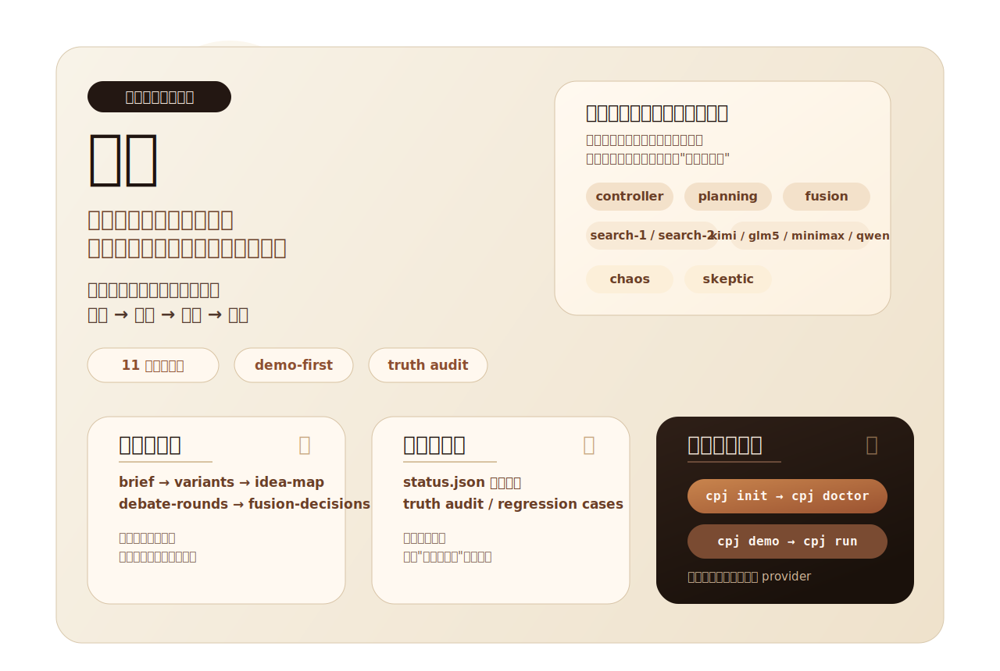

# 皮匠

<p align="center">
  
</p>

<p align="center">
  <a href="https://github.com/qiuxinyuan321/pijiang/actions/workflows/ci.yml"></a>
  <a href="LICENSE"></a>
  
  
  
  
</p>

> 三个臭裨将，顶个诸葛亮。

`皮匠` 把真实多模型议会做成了一个可嵌入现有入口的能力层。

它不是让一个模型扮演多个角色，而是把多个真实模型位组织成一套可执行的议会工作流，让不同模型分别承担不同分析职责，然后完成：

`发散 -> 对抗 -> 整合 -> 收敛`

对外安装包名是 `pijiang`，主命令是 `cpj`。

## 一眼看懂

| 你最关心什么 | 先看哪里 |
| --- | --- |
| 我想先跑通一次 | [3 分钟上手](#3-分钟上手) |
| 我想先理解它到底是什么 | [它是什么，不是什么](#它是什么不是什么) |
| 我想看图解与议会结构 | [docs/demo-visuals.md](docs/demo-visuals.md) |
| 我想看首次可信成功路径 | [docs/first-success-path.md](docs/first-success-path.md) |
| 我想看支持边界 | [docs/support-matrix.md](docs/support-matrix.md) |
| 我想看已回流并验证过的运行时能力 | [docs/runtime-backflow-validation.md](docs/runtime-backflow-validation.md) |
| 我准备参与贡献 | [CONTRIBUTING.md](CONTRIBUTING.md) |

## 它是什么，不是什么

| `皮匠` 是什么 | `皮匠` 不是什么 |
| --- | --- |
| 一个面向复杂议题的多模型、多职责议会能力层 | 一个模型切换语气来“扮演 10 个人” |
| 一个可嵌入现有入口的高阶决策能力 | 强迫用户切换到全新重应用 |
| 一条结构化方案链，而不只是单段回答 | 只在聊天窗口里吐一段看起来完整的答案 |
| 一个带 `demo -> doctor -> truth audit` 的真实工作流 | 带着半残配置直接硬跑的黑盒脚本 |

## 黄金路径

新用户的官方主线不是“下载后直接 `cpj run`”，而是这条更稳的首次成功路径：

| 步骤 | 命令 | 作用 | 你会看到什么 |
| --- | --- | --- | --- |
| 1 | `cpj init` | 生成标准配置与 Obsidian 模板 | 官方 10 席拓扑、`demo-config.json` |
| 2 | `cpj doctor` | 体检 readiness，而不是带病硬跑 | `ready / warning / blocker` |
| 3 | `cpj demo` | 零 API 验证系统价值 | 完整产物链与可视化结构 |
| 4 | `cpj run` | 在 provider 准备好后进入真实运行 | 多模型议会输出、truth audit、regression cases |

如果你只记一句话，记这句：

> **先看到价值，再接真实 provider；先过 doctor，再进 real run。**

## 10 席完整议会，只在首页保留总览

首页先讲清职责分工，不把细节一次性全部展开。

| 职责层 | 席位 | 作用 |
| --- | --- | --- |
| 主控层 | `controller` | 总体调度、收敛策略、降级决策 |
| 规划层 | `planning` | 结构化规划与 variant 补强 |
| 搜索层 | `search-1 / search-2` | 外部资料、案例与实现证据 |
| 裨将层 | `marshal-1 / marshal-2 / marshal-3` | 工程落地、结构压缩、体验与部署路径 |
| 对抗层 | `chaos / skeptic` | 打破局部最优、红队拆解与失败模式攻击 |
| 融合层 | `fusion` | 决策账本、最终合并与终版输出 |

完整图解和更细的说明放在 [docs/demo-visuals.md](docs/demo-visuals.md)。

<details>
<summary>展开 10 席完整说明</summary>

| 席位 | 职责 |
| --- | --- |
| `controller` | 主控，负责总体调度与最终收敛 |
| `planning` | 规划者，优先由 coding plan provider 承担 |
| `search-1` | 外部搜索者，偏产品/网页/资料检索 |
| `search-2` | 外部搜索者，偏 GitHub/案例/实现检索 |
| `marshal-1` | 裨将，偏工程可执行性与落地路径 |
| `marshal-2` | 裨将，偏结构整理、约束归纳与方案压缩 |
| `marshal-3` | 裨将，偏用户体验、可部署性与新手路径 |
| `chaos` | 混沌者，负责打破局部最优 |
| `skeptic` | 质疑者，负责红队拆解与失败模式 |
| `fusion` | 融合者，负责最终合并、决策账本与终版输出 |

</details>

## 已验证的可信信号

首页不做花哨看板，只放已经存在、而且仓库内有承接文档的事实型信号。

| 信号 | 当前状态 | 去哪里看 |
| --- | --- | --- |
| `cpj init / doctor / demo / run` 主链路 | 已固化 | [docs/first-success-path.md](docs/first-success-path.md) |
| `single / reduced6 / standard10` benchmark gate | 已完成 | [docs/runtime-backflow-validation.md](docs/runtime-backflow-validation.md) |
| run 后 `truth audit` | 已回流 | [docs/runtime-backflow-validation.md](docs/runtime-backflow-validation.md) |
| `regression cases` 留痕 | 已回流 | [docs/runtime-backflow-validation.md](docs/runtime-backflow-validation.md) |
| 官方支持边界 | 已整理 | [docs/support-matrix.md](docs/support-matrix.md) |

这部分故意只写“已经证实的东西”。下面这些能力仍然保留，但**不会**在首页宣称已经完整生效：

- `soft_budget`
- `hard_budget`
- `circuit_breaker_threshold`
- `quality_retry_threshold`
- fallback replacement
- 本地议会的字节级 subprocess streaming

## 你最终拿到的不是一句答案，而是一条产物链

`cpj demo` 和 `cpj run` 的价值，在于它们都不会只给你一段最终文本。

```text
brief
-> 10 路 variants
-> idea-map
-> debate-round-1
-> debate-round-2
-> fusion-decisions
-> final-solution-draft
-> Obsidian / CLI 输出
```

这条链路的意义是：

- 你能回看不同席位的思路来源
- 你能看到对抗和融合，而不是“答案突然出现”
- 你能把输出当作方案草案，而不是一次性聊天记录

## 安装

README 只保留最稳、最短的安装路径。更细的发布策略见 [docs/release-policy.md](docs/release-policy.md)。

| 场景 | 命令 |
| --- | --- |
| 从源码目录安装 | `pipx install .` |
| 从源码目录安装（`uv`） | `uv tool install .` |
| 从 wheel 安装 | `python -m build` 然后 `python -m pip install dist\\pijiang-0.1.0-py3-none-any.whl` |
| 未来 PyPI 直装 | `pipx install pijiang` |

说明：

- 当前版本：`0.1.0`
- Python 要求：`3.11+`
- PyPI 命令属于目标形态；是否已实际发布，请以 release 或 PyPI 页面为准

## 3 分钟上手

### 1. 初始化标准配置与 Obsidian 模板

```powershell
cpj init --yes
```

它会生成：

- 一份标准配置
- 一份 `demo-config.json`
- 官方 `10` 席议会拓扑
- 官方 Obsidian Vault 模板

### 2. 先体检，而不是硬跑

```powershell
cpj doctor
```

如果你要把结果交给自动化系统判断：

```powershell
cpj doctor --json
```

`doctor` 会明确告诉你：

- 标准拓扑席位数
- 当前已启用席位数
- 当前可真实运行席位数
- readiness 是 `ready / warning / blocker`
- 哪些 provider 仍然只是占位模板
- 每个 HTTP provider 当前命中了 `relay_url`、结构化 endpoint，还是 legacy `base_url`

### 3. 先跑 demo，看系统价值

```powershell
cpj demo
```

`cpj demo` 不会调用真实外部 API，但会完整跑出一条 10 席产物链，并落到 Obsidian 模板目录里。默认会生成：

- `00-brief.md`
- `01-run-overview.md`
- `30-idea-map.md`
- `40-debate-round-1.md`
- `41-debate-round-2.md`
- `50-fusion-decisions.md`
- `90-final-solution-draft.md`

### 4. 再接真实 provider

```powershell
cpj run --brief "examples\\briefs\\project-parliament.md" --topic "议会项目级能力化"
```

首次真实运行前，`cpj run` 会固定做三件事：

1. 说明工作原理
2. 提醒多模型决策会明显更慢
3. 要求你确认后才真正开始调用

如果 `doctor` 有 blocker，`cpj run` 会直接拒绝执行。

## Obsidian 是强推荐默认体验

`Obsidian` 不是硬阻断依赖，但它是当前最完整的可视化面板。

- Mermaid 负责讲清关系与流程
- Vault 负责承接真实 run 产物
- `demo` 能让新用户在零 API 的情况下先看到系统价值

<details>
<summary>展开查看默认 Vault 结构</summary>

```text
obsidian-vault/
├─ 00-Start-Here.md
├─ 10-Dashboards/
│  ├─ 当前议题总览.md
│  ├─ 10席议会拓扑.md
│  ├─ 运行历史.md
│  └─ 执行进度.md
└─ 皮匠/
   └─ <topic>/
      └─ 方案工厂/
         └─ <run-id>/
            ├─ 00-brief.md
            ├─ 01-run-overview.md
            ├─ 10-controller.md
            ├─ 11-planning.md
            ├─ 12-search-1.md
            ├─ 13-search-2.md
            ├─ 14-marshal-1.md
            ├─ 15-marshal-2.md
            ├─ 16-marshal-3.md
            ├─ 17-chaos.md
            ├─ 18-skeptic.md
            ├─ 19-fusion.md
            ├─ 30-idea-map.md
            ├─ 40-debate-round-1.md
            ├─ 41-debate-round-2.md
            ├─ 50-fusion-decisions.md
            ├─ 70-run-truth-audit.json
            ├─ 80-regression-cases-index.md
            ├─ 90-final-solution-draft.md
            └─ 99-index.md
```

</details>

## 第三方中转站与自定义端口

这一层只是扩展 HTTP 接入兼容面，不会改变 `皮匠` 的议会机制。

- 它支持的是 provider endpoint 的兼容升级
- 不是把多模型议会退化成单模型角色扮演
- `cpj run` 仍然必须先通过 readiness gate

你可以在 `cpj init` 生成的 `config.json` 里直接编辑 provider 的 endpoint 字段。

<details>
<summary>展开 relay / 自定义端口配置示例</summary>

### 旧写法：直接使用 `base_url`

```json
{
  "id": "controller-primary",
  "adapter_type": "openai_compatible",
  "base_url": "https://api.openai.com/v1"
}
```

### 结构化写法：`host + port + path_prefix`

```json
{
  "id": "controller-primary",
  "adapter_type": "openai_compatible",
  "scheme": "http",
  "host": "127.0.0.1",
  "port": 8000,
  "path_prefix": "/v1"
}
```

### 中转站直连：`relay_url`

```json
{
  "id": "controller-primary",
  "adapter_type": "openai_compatible",
  "relay_url": "https://your-relay.example.com/openai"
}
```

优先级固定为：

1. `relay_url`
2. `host + port + path_prefix`
3. `base_url`

</details>

## 兼容面

官方首发兼容：

- `OpenAI-compatible`
- `Ollama`
- `Alibaba Coding Plan`
- `Volcengine Coding Plan`

可选社区适配：

- `Codex CLI`
- `Claude Code CLI`
- `OpenCode CLI`

其中：

- `controller` 独立于 `planning`
- `coding plan` 是官方一等公民 Planning Provider
- 系统建议把强模型放在 controller 位，但不强制

更细的支持分层见 [docs/support-matrix.md](docs/support-matrix.md)。

## 当前项目状态

当前更接近 `v0.x` 阶段，重点在：

- 把 `cpj init / doctor / demo / run` 做成稳定主线
- 让陌生用户下载后先看到价值，再接真实 provider
- 把 runtime 回流能力、truth audit 和 regression cases 稳定下来
- 把 GitHub 首页从“长文档”重构成“产品首页 + 文档路由器”

## 当前官方主线

当前官方主线已经收敛成一条黄金路径：

- `cpj init -> cpj doctor -> cpj demo -> cpj run`
- `Phase A+` 先只做“首次可信成功路径”
- `Phase B` 再做 Obsidian 单宿主闭环
- `Phase C` 才进入更通用的宿主 contract 与能力化抽象

如果你只想先做对一次，先看：

- [docs/first-success-path.md](docs/first-success-path.md)
- [docs/support-matrix.md](docs/support-matrix.md)
- [docs/release-policy.md](docs/release-policy.md)

当前 issue backlog 入口：

- [GitHub Issues](https://github.com/qiuxinyuan321/pijiang/issues)

## 当前明确不做什么

这些方向不是否定，而是当前不抢主线：

- 不把多宿主深集成提前到 `Phase A+`
- 不在官方主路径未稳定前同时铺太多发布渠道
- 不在支持矩阵尚未冻结前对更多 provider 做深度承诺
- 不把“demo 路径”和“真实 run 路径”做成两套不同契约
- 不把项目重新拉回“单模型扮演多个角色”的叙事

## 路线图与文档入口

- 路线图：[docs/ROADMAP.md](docs/ROADMAP.md)
- 支持矩阵：[docs/support-matrix.md](docs/support-matrix.md)
- 发布策略：[docs/release-policy.md](docs/release-policy.md)
- 图解说明：[docs/demo-visuals.md](docs/demo-visuals.md)
- 首次成功路径：[docs/first-success-path.md](docs/first-success-path.md)
- 运行回流验证：[docs/runtime-backflow-validation.md](docs/runtime-backflow-validation.md)
- 贡献指南：[CONTRIBUTING.md](CONTRIBUTING.md)
- 安全策略：[SECURITY.md](SECURITY.md)

## 仓库结构

- `pijiang/`: 正式发布主包
- `tests/`: CLI、provider endpoint、路径与回归测试
- `docs/`: 公开文档
- `examples/`: 示例 brief
- `tools/solution_factory/`: 历史兼容与内部参考

## 当前命令面

- `cpj init`
- `cpj doctor`
- `cpj demo`
- `cpj integrate <host>`
- `cpj run`

## License

本项目采用 `MIT` License，详见 [LICENSE](LICENSE)。
