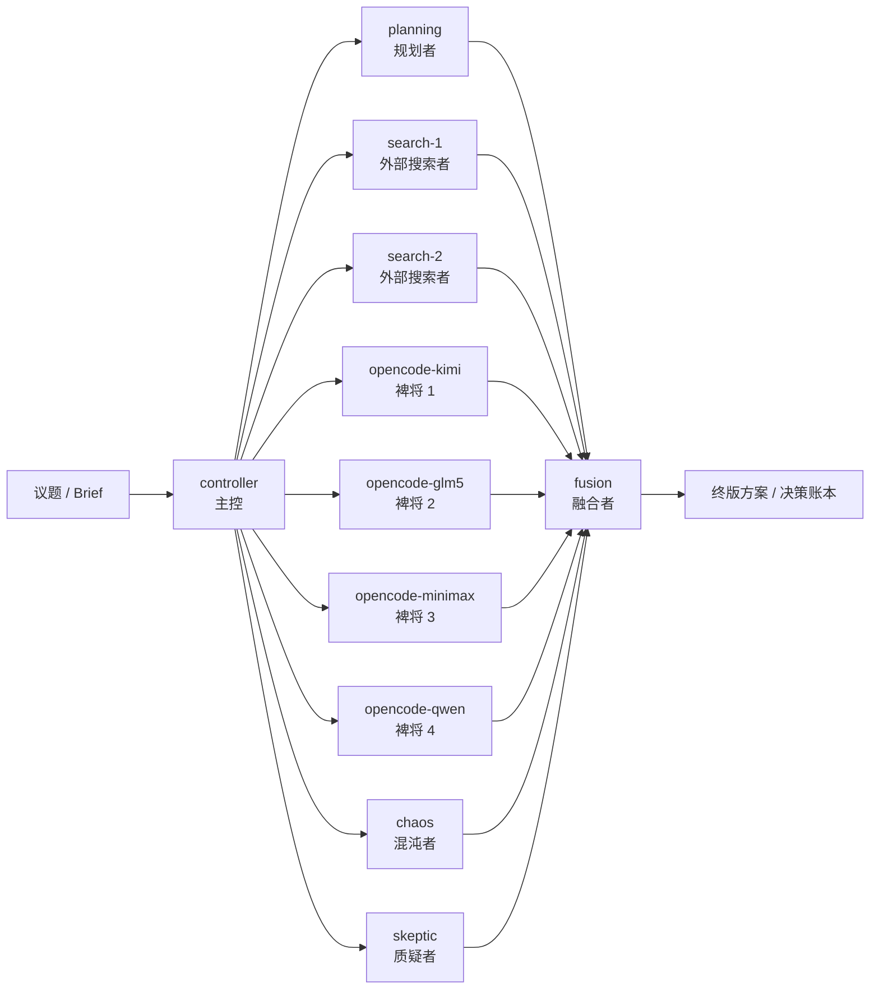
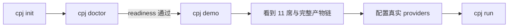

# 皮匠图解

README 现在更偏“产品首页 + 文档路由器”，因此把更完整的图解承接到这里，不让首页继续堆太多 Mermaid 和长解释。

返回总导航见 [index.md](index.md)。

这份文档专门回答三个问题：

1. `11` 席议会到底在表达什么
2. 为什么推荐 `cpj init -> cpj doctor -> cpj demo -> cpj run`
3. 为什么 `demo` 不是玩具，而是价值验证路径

## 图 1：11 席议会拓扑

### 看图说明

- 这不是一个模型在演十一个身份。
- 这是多个真实模型位分别承担分析职责，然后把产出汇到 `fusion`。
- `controller` 独立于 `planning`，因为“总体调度”和“结构化规划”不是一回事。
- `skeptic` 存在的意义是打破自我说服，让系统保留真正的反对意见。
- `chaos` 不是搞乱流程，而是负责打破局部最优和惯性方案。

## 图 2：新用户最短路径

### 看图说明

- `cpj init` 的作用不是让你马上运行，而是先生成标准结构。
- `cpj doctor` 是门禁，不是附加项。它负责告诉你当前配置是 `ready`、`warning` 还是 `blocker`。
- `cpj demo` 是零 API 的价值验证路径，先让用户看到系统到底会产出什么。
- 只有当 provider 配好之后，`cpj run` 才应该承担真实外部调用。

## 图 3：demo 产物链

### 看图说明

- `brief` 不是终点，只是输入。
- `variants` 表示不同席位的并行产出，不再是单条回答。
- `idea-map` 是初步融合，不是最终定稿。
- `debate-rounds` 让系统有显式对抗过程，尤其是质疑位能真正参与。
- `fusion-decisions` 会沉淀成决策账本，而不是只保留结果文本。
- `final-solution-draft` 是可以复盘的终版草案，不是一闪而过的聊天回复。

## 为什么坚持“多模型、多职责”，而不是“单模型多角色扮演”

核心原因只有一个：两者不是一个东西。

- 单模型多角色扮演，本质上还是一个推理源在自我切换语气和视角。
- 多模型、多职责议会，才可能真正引入不同模型偏好、不同 provider 能力、不同失败模式与不同思路路径。
- 这也是为什么 `controller`、`planning`、`search`、四个 `opencode-*` 裨将、`chaos`、`skeptic`、`fusion` 被当成职责，而不是人格。

皮匠的目标不是“演一场会议”，而是把真实的多路分析整合流程做成可执行能力。

## 为什么 demo-first 比直接 real run 更适合开源项目

对开源项目来说，最大的问题不是“有没有功能”，而是“陌生用户能不能在几分钟内看到价值”。

如果一上来就要求：

- 配好多个 API Key
- 配好 provider endpoint
- 配好 command bridge
- 然后再 real run

那么绝大多数用户在看到系统价值之前就会先撞上配置问题。

`demo-first` 的意义是：

- 先看到 11 席拓扑
- 先看到产物链
- 先看到 Obsidian 目录结构
- 再决定要不要继续接真实 providers

这不是降低系统严肃性，而是先把价值展示出来，再要求用户投入配置成本。
